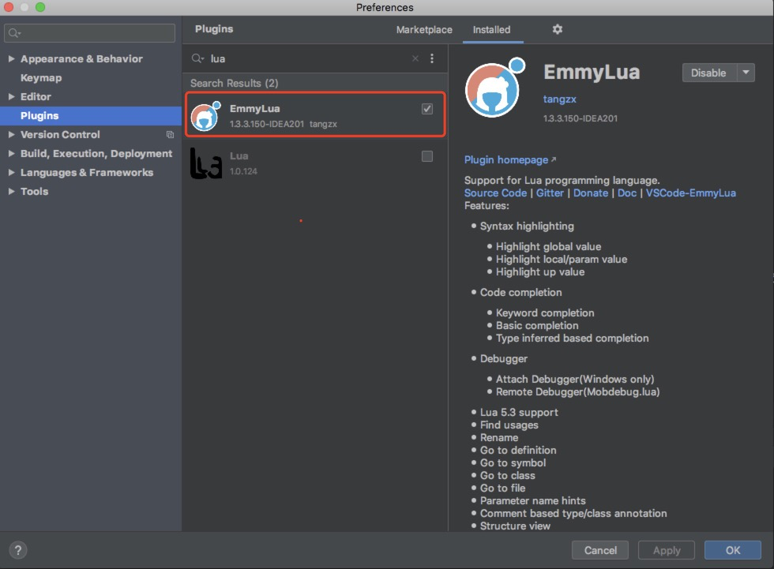
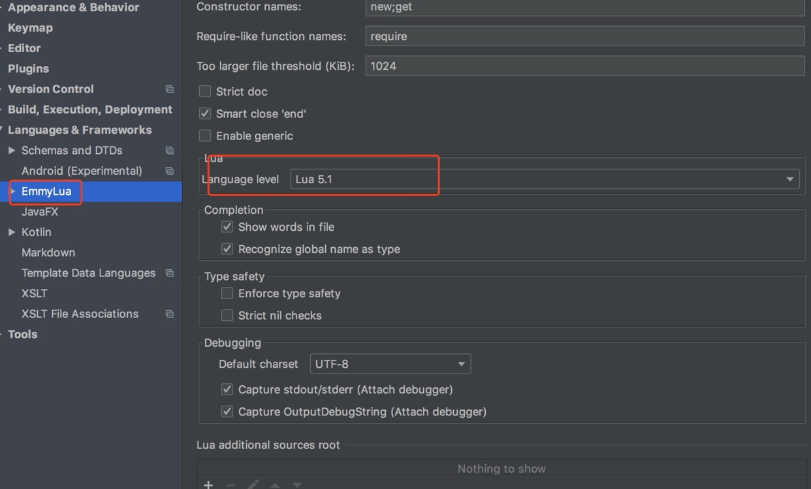
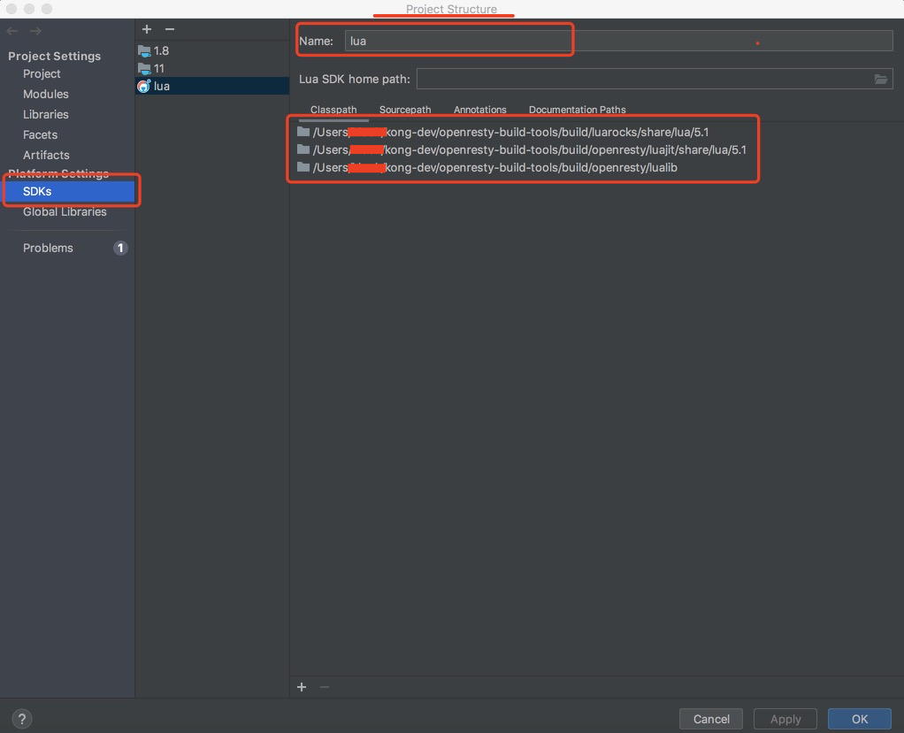
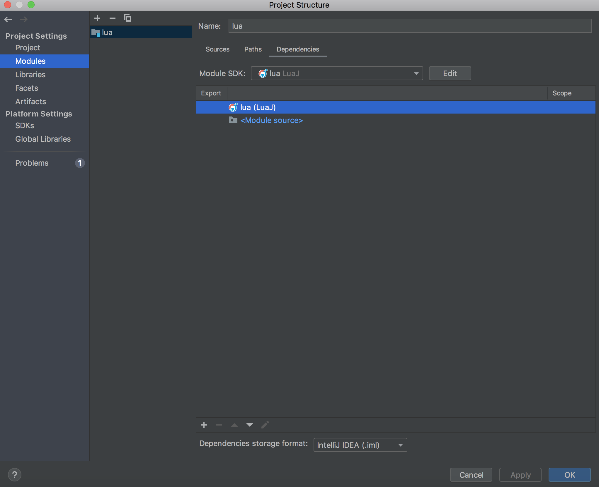

# kong-plugin-dev


本项目主要是帮助大家快速入门kong插件的开发，并且集成到kong的测试环境，理解kong是如何测试插件，同时大家也可以快速了解lua及openresty的开发；   
说明： 文件内容来自kong源码，可以通以下命令克隆
```
git clone git@github.com:Kong/kong.git
```


## 一、环境搭建

### 1.1 基础环境搭建

克隆本项目

```
git clone git@github.com:lecw199/kong-plugin-dev.git 
```

执行环境安装
```
cd  kong-plugin-dev/.ci
sh setup_env.sh
```

可以仔细阅读下setup_env.sh脚本，看看这个脚本做了什么？
1、安装openresty
2、配置openresty环境变量
3、安装go pluginsever
4、安装Test::Nginx -- nginx测试组件
5、docker启动 grpcbin 这个是grpc server， 当前bin目录下的grpcurl是client，用于测试kong grpc服务


执行make dev命令，帮助你安装所有的lua包
```
make dev
```

**注意**：
*   如果上面的setup_env.sh执行失败，可以参考直接参当前目录下的DEVELOPER.MD文件配置openresty；
*   最好环境变量写入到.bashrc(linux) .bash_profile(mac)文件中


### 1.2 开发工具选择及配置

lua开发工具其实很多，常用IDE，例如：luaEditor、Lua Development Tools (LDT)等， 插件形式的开发工具，例如VSCode+插件，IDEA+插件等； 通过试用对比，我们还是选择了IDEA + Emmylua插件搭建开发环境，主要是习惯好用，代码跳转也支持的非常好！


下载[IDEA](https://www.jetbrains.com/idea/download/#section=mac)，选择对应的环境下载，直接点击安装即可；


安装Plugins， Emmylua



将lua的版本设为5.1, 默认会选择5.3的版本



配置路径， 以下三个路径必须要配置进去：luarocks路径配置进去， luajit的路径，openresty路径
可以参考以下命令输出的内容：

```
luarocks path
```



配置好SDK路径后，在Module SDK， 选择你之前定义的SDK名称




以上步骤配置好后，代码已经可以跳转了，可以看看其他插件的源码学习下了
