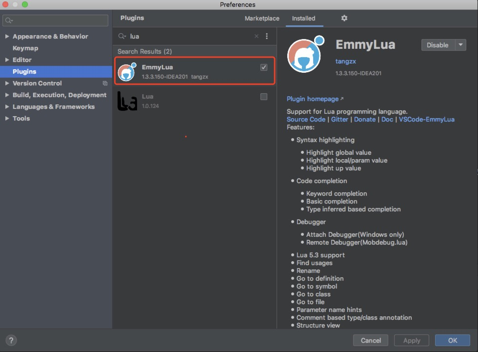
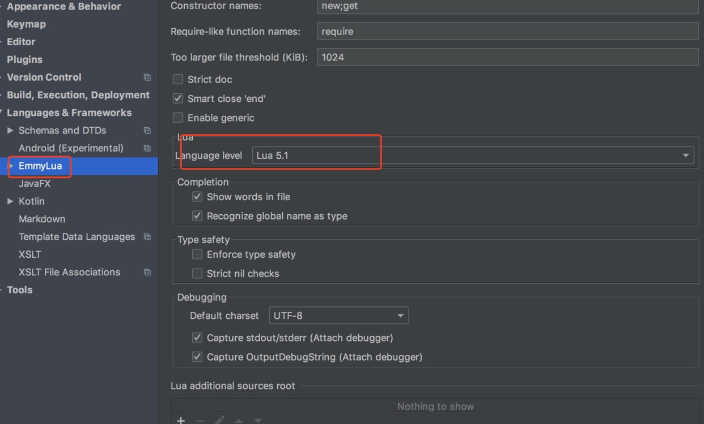
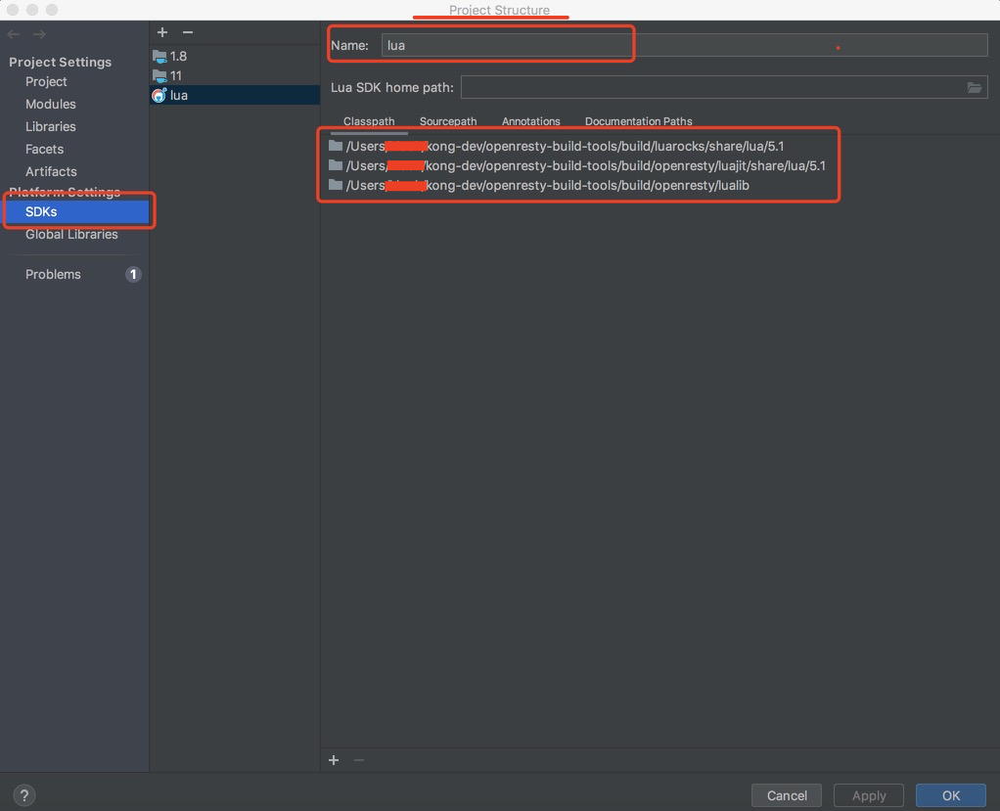
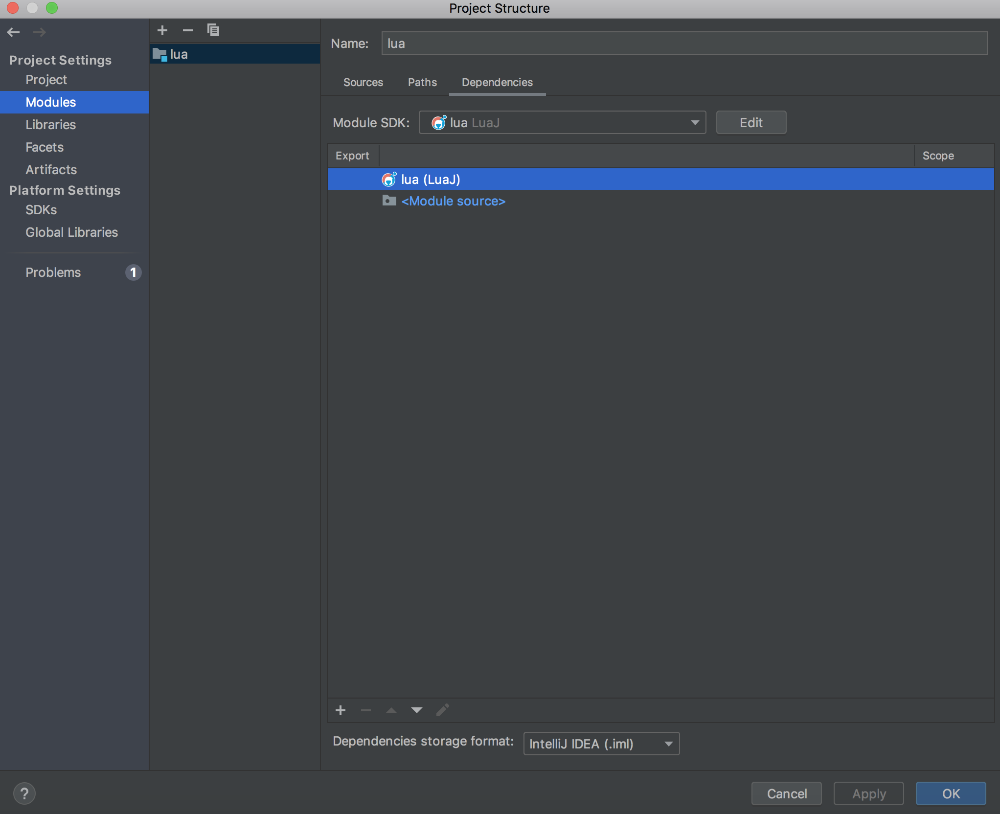
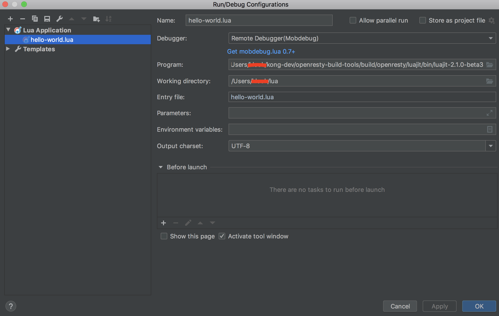

# kong-plugin-dev


本项目主要是帮助大家快速入门kong插件的开发，并且集成到kong的测试环境，理解kong是如何测试插件，同时大家也可以快速了解lua及openresty的开发；   
说明： 文件主要内容来自kong源码，可以通以下命令克隆
```
git clone git@github.com:Kong/kong.git
```

## 一、环境搭建

### 1.1 基础环境搭建

* 使用本库自带脚本安装openresty，脚本会自动配置环境变量，可以直接make安装；  
openresty安装路径 /usr/local/Cellar/openresty-build-tools
```
make install-openresty
```

* 安装依赖包
安装好openresty之后，执行make dev命令，帮助你安装所有的lua包
```
make dependencies
```


**注意**：
*   该部署脚本限于mac，其他的系统可能没有对应的路径，建议自己修改安装路径
*   如果依赖问题很难解决，可以先用brew安装kong, 这样依赖可以解决, 注意kong版本
```
brew tap kong/kong
brew install kong
```


### 1.2 开发工具选择及配置

lua开发工具其实很多，常用IDE，例如：luaEditor、Lua Development Tools (LDT)等， 插件形式的开发工具，例如VSCode+插件，IDEA+插件等； 通过试用对比，我们还是选择了IDEA + Emmylua插件搭建开发环境，主要是习惯好用，代码跳转也支持的非常好！


下载[IDEA](https://www.jetbrains.com/idea/download/#section=mac)，选择对应的环境下载，直接点击安装即可；


安装Plugins， Emmylua



将lua的版本设为5.1, 默认会选择5.3的版本



配置路径， 以下三个路径必须要配置进去：luarocks路径配置进去， luajit的路径，openresty路径
可以参考以下命令输出的内容：

```
luarocks path
```

建议配置路径如下：

```
/usr/local/Cellar/openresty-build-tools/build/luarocks/share/lua/5.1
/usr/local/Cellar/openresty-build-tools/build/openresty/luajit/share/lua/5.1
/usr/local/Cellar/openresty-build-tools/build/openresty/lualib
```




配置好SDK路径后，在Module SDK， 选择你之前定义的SDK名称




以上完成后，代码已经可以跳转了（注意：c语言实现的库无法跳转），可以看看其他插件的源码学习下了


写个hello-world，练下lua语法，Program配置为openresty目录的luajit路径， 点击run跑起来




## 二、测试
kong测试是基于busted的，所以需要了解下这个测试，写插件时可以仿造其他插件 ，一般可以到luarocks源码包里看，   
luarocks/share/lua/5.1/kong，如果你配置好了SDK，可以在IDE的External Libraries的目录下找到kong源码

参考插件测试，spec/02-plugins/26-hello-world/01-hello_world_spec.lua， helpers.start_kong命令启动一个kong来做测试，
kong里面自带很多mock接口，可以在测试代码里面用ngx.sleep睡眠一下， 
```
ps -ef |grep nginx 
```
然后切到对应的nginx配置文件看到底启动了哪几个mock接口。


测试代码还是保存在spec目录，当然可以尽情的抄袭这些测试代码！
### 2.1 单元测试

启动测试
```
make test-self file=spec/01-unit/020-hello_word_spec.lua
```

### 2.2 plugin测试
做插件测试时， kong的测试fixture会帮我们启动一个kong， 查看helpers.lua代码；   
在测试代码中，启动kong时，一定要配置plugins和lua_package_path,不然无法启动自己编写的插件

```
assert(helpers.start_kong({
        database   = strategy,
        plugins = "hello-world",  -- 启用插件
        lua_package_path = "./kong/plugins/hello-world/?.lua", -- 配置插件路径
        nginx_conf = "spec/fixtures/custom_nginx.template",
      }))

```

启动测试
```
make test-self file=spec/03-plugins/26-helloworld/01-hello_spec.lua
```